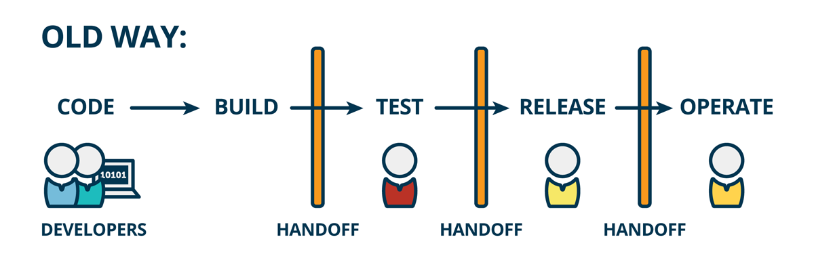
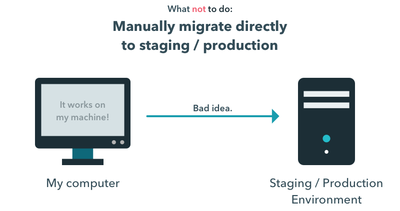
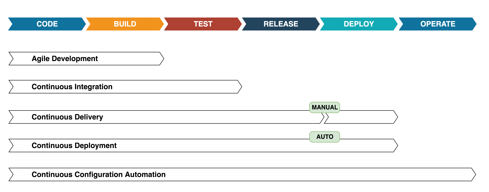
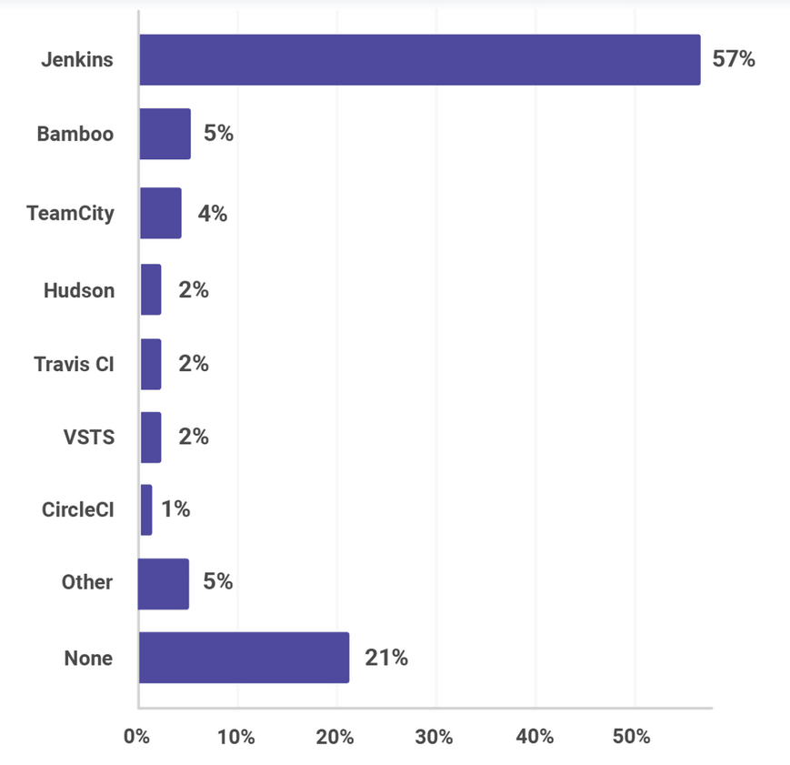

<!-- .slide: data-background="images/title.png" data-background-size="120% 100%" -->
<br/>
<h2 style="margin-left: -60px; text-align: left">Vortrag 1</h2>
<br/>
<br/>
<p style="margin-left: -60px; text-align: left">
  <b>Manfred Zingl</b>
</p>

<p style="margin-left: -60px; text-align: left; font-size: 0.6em;">
Software Engineer<br/>
Campudus
</p>

---

### About me

<br/>
<br/>
<br/>

- Softwareentwickler bei Campudus GmbH
- Projektbasierte Entwicklung
- Backend Entwicklung des Produkts GRUD

---

### old process

<br/>
<br/>
<figure>
  
  <figcaption style="font-size: 10px;">https://www.mindtheproduct.com/2016/02/what-the-hell-are-ci-cd-and-devops-a-cheatsheet-for-the-rest-of-us/</figcaption>
</figure>

<!--  .element height="100%" width="100%" -->

-+-

### Don't do this

<br/>

<figure>
  
  <figcaption style="font-size: 10px;">https://www.devbridge.com/articles/continuous-integration-delivery-and-deployment-in-net-projects/</figcaption>
</figure>

---

### new process

<div style="align: center">
  <figure>
    
    <figcaption style="font-size: 10px;">https://www.mindtheproduct.com/2016/02/what-the-hell-are-ci-cd-and-devops-a-cheatsheet-for-the-rest-of-us/</figcaption>
  </figure>
</div>

---

### Continuous "Everything"

<!-- .slide: data-transition="none" -->

<br/>
<br/>



---

### Buildservers

<br/>

<div style="margin-left: 50px; text-align: left; float: left; display: table; table-layout: fixed;">
  <ul>
  <li>Jenkins</li>
  <li>Teamcity</li>
  <li>Bamboo</li>
  <li>circleCI</li>
  <li>GitLab CI</li>
  <li>Travis CI</li>
  <li>drone.io</li>
  <li>...</li>
  </ul>
</div>
<div style="margin-right: 50px; text-align: right; float: right; display: table; table-layout: fixed;">
<figure><!-- .element: class="fragment" data-fragment-index="1" -->
  
  <figcaption style="font-size: 10px; text-align: center;">https://snyk.io/blog/jvm-ecosystem-report-2018-tools/</figcaption>
</figure>
</div>

---

### Jenkins

<br/>
<br/>

- 14 years old (Hudson 2005)</li>
- 150,000+ active installations</li>
- 1,300+ plugins</li>
- Scalable</li>
- Extensible</li>
- Flexible</li>
- Open Source</li>
- Jenkins 2.0 Pipeline as code (2016)</li>

-+-

### Jenkins Pipeline

```groovy
pipeline {
  agent any
  stages {
    stage('Build') {
      steps {
        sh './gradlew build'
      }
    }
    stage('Test') {
      steps {
        sh './gradlew test'
      }
    }
  }
  post {
    failure {
      mail to: 'team@xy.com', subject: 'Pipeline failed', body: "${env.BUILD_URL}"
    }
  }
}
```
<!-- .element: class="fragment" data-fragment-index="1" -->

<figcaption style="font-size: 10px; text-align: center;">https://jenkins.io/doc/book/pipeline/</figcaption>
<!-- .element: class="fragment" data-fragment-index="1" -->

---

### Best practices

<br/>
<br/>

- Send out notifications
- Use parameterized builds
- No Dependencies in Buildserver
- Backup of buildserver or dockerize

---


# Demo Time

---

<br/>

### Danke

<br/>
<br/>

<p>
  <span style="margin-left: 30px;">
  <b>Manfred Zingl</b><br/><br/>
  Campudus GmbH<br/>
  Ludwig-Erhard-Straße 6<br/>
  84034 Landshut<br/><br/>
  E-Mail: <a href="mailto:mz@campudus.com">mz@campudus.com</a><br/>
  Web: <a href="campudus.com">campudus.com</a>
<br/>
<br/>
<br/>
<br/>
  Repo: <a href="https://github.com/zingmane/meetup-jenkins-pipelines">https://github.com/zingmane/meetup-jenkins-pipelines</a>
  </span>
</p>

<br/>
<br/>
<br/>
